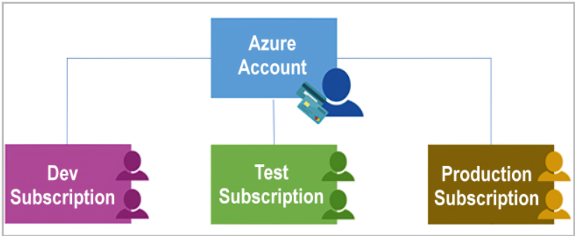
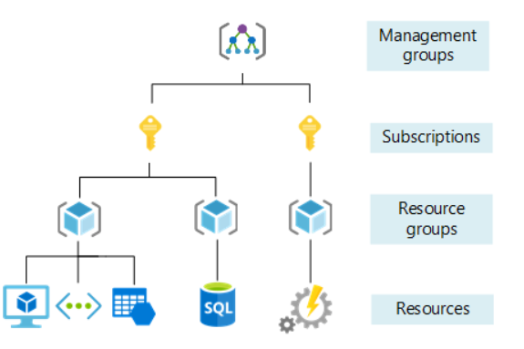

## Physical infrastructure

- The physical infrastructure for Azure starts with datacenters.
- Datacenters are grouped into Azure Regions or Azure Availability Zones (AZ)

**Regions**
- A region is a geographical area on the planet that contains at least one, but potentially multiple datacenters that are nearby and networked together with a low-latency network.
- When you deploy a resource in Azure, you'll often need to choose the region where you want your resource deployed.

>Some services or virtual machine (VM) features are only available in certain regions, such as specific VM sizes or storage types. There are also some global Azure services that don't require you to select a particular region, such as Microsoft Entra ID, Azure Traffic Manager, and Azure DNS.

**Availability Zones**
- Availability zones are physically separate datacenters within an Azure region. 
- Each availability zone is made up of one or more datacenters equipped with independent power, cooling, and networking. 
- An availability zone is set up to be an isolation boundary. 
- If one zone goes down, the other continues working.

>To ensure resiliency, a minimum of three separate availability zones are present in all availability zone-enabled regions. However, not all Azure Regions currently support availability zones.

**Region pairs**
- Most Azure regions are paired with another region **within the same geography** (such as US, Europe, or Asia) **at least 300 miles away**. 
- This approach allows for the replication of resources across a geography that helps reduce the likelihood of interruptions because of events such as natural disasters, civil unrest, power outages, or physical network outages that affect an entire region.

>Not all Azure services automatically replicate data or automatically fall back from a failed region to cross-replicate to another enabled region. In these scenarios, recovery and replication must be configured by the customer.

## Azure management infrastructure

- The management infrastructure includes Azure resources and resource groups, subscriptions, and accounts.

#### Azure Resources and Resource Groups

- **Resource** 
	- A resource is the basic building block of Azure. 
	- Anything you create, provision, deploy, etc. is a resource. 
	- Virtual Machines (VMs), virtual networks, databases, cognitive services, etc. are all considered resources within Azure.

- **Resource groups** 
	- Resource groups are simply groupings of resources. 
	- When you create a resource, you’re required to place it into a resource group. 
	- While a resource group can contain many resources, a single resource can only be in one resource group at a time.
	- Resource groups provide a convenient way to group resources together. When you apply an action to a resource group, that action will apply to all the resources within the resource group

#### Azure subscriptions

- In Azure, subscriptions are a unit of management, billing, and scale. 
- Similar to how resource groups are a way to logically organize resources, subscriptions allow you to logically organize your resource groups and facilitate billing.
- An account can have multiple subscriptions, but it’s only required to have one.
- 

#### Azure Management Groups

- Resources are gathered into resource groups, and resource groups are gathered into subscriptions.
- Azure management groups provide a level of scope above subscriptions. You organize subscriptions into containers called management groups and apply governance conditions to the management groups. 
- All subscriptions within a management group automatically inherit the conditions applied to the management group, the same way that resource groups inherit settings from subscriptions and resources inherit from resource groups. 
- Management groups give you enterprise-grade management at a large scale, no matter what type of subscriptions you might have. 
- Management groups can be nested.
- 

# Azure Compute and Networking Services

#### Azure Virtual Machines

- VMs provide infrastructure as a service (IaaS) in the form of a virtualized server.
- Just like a physical computer, you can customize all of the software running on your VM.

#### Scaling VMs in Azure

- **Single VMs vs. Grouped VMs**:
    
    - Single VMs are suitable for testing, development, or minor tasks.
    - Grouping VMs enhances high availability, scalability, and redundancy.

- **Virtual Machine Scale Sets**:
    
    - Manage a group of identical, load-balanced VMs.
    - Azure automates VM configuration, network routing, and scaling.
    - Automatically adjusts the number of VM instances based on demand or a predefined schedule.
    - Deploys automatically to optimize resource usage.
    - Ideal for large-scale compute, big data, and container workloads.

- **Virtual Machine Availability Sets**:
    
    - Enhance resilience and availability.
    - **Update Domain**:
        - Groups VMs that can be updated simultaneously.
        - Only one update domain is offline at a time; update process allows 30 minutes for recovery.
    - **Fault Domain**:
        - Groups VMs by common power source and network switch.
        - Splits VMs across up to three fault domains to protect against power or networking failures.

- **VM Resources**

- When you provision a VM, you’ll also have the chance to pick the resources that are associated with that VM, including:

	- Size (purpose, number of processor cores, and amount of RAM)
	- Storage disks (hard disk drives, solid state drives, etc.)
	- Networking (virtual network, public IP address, and port configuration)

# Azure Containers

- **What Are Containers?**
    
    - Containers are a virtualization environment allowing multiple instances to run on a single host machine.
    - Unlike VMs, you don’t manage the operating system for containers.
    - Containers are lightweight, agile, and designed for dynamic creation, scaling, and stopping.
    - Quick to restart, adaptable to demand changes, and support popular container engines like Docker.

- **Comparison with Virtual Machines**:
    
    - **Virtual Machines**: Provide a full OS instance, requiring more resources and management.
    - **Containers**: Share the host OS, making them more resource-efficient and flexible.

- **Azure Container Services**:
    
    - **Azure Container Instances (ACI)**
        - Fastest way to run containers in Azure with minimal management.
        - Platform as a Service (PaaS).
        - Upload and run containers without handling VMs or additional services.

    - **Azure Container Apps**
        - Similar to ACI but with additional features.
        - PaaS.
        - Includes load balancing and scaling, offering more elasticity in design.

    - **Azure Kubernetes Service (AKS)**
        - Container orchestration service for managing the lifecycle of containers.
        - Simplifies and optimizes management of container fleets.

- **Using Containers in Solutions**:
    
    - **Microservice Architecture**: Breaks solutions into smaller, independent components (e.g., front end, back end, storage).
    - **Scalability**: Allows independent scaling of components based on specific needs.
    - **Flexibility**: Facilitates updates or changes to individual components without impacting others.

# Azure Functions (Serverless)

- **What Are Azure Functions?**
    
    - **Description**: An event-driven, serverless compute option that eliminates the need to manage virtual machines or containers.
    - **Operation**: Functions are triggered by events (e.g., REST requests, timers, or messages from Azure services) and only run when needed.
    - **Resource Management**: Automatically deallocates resources after execution, reducing the need to keep resources provisioned.

- **Benefits of Azure Functions**:
    
    - **Event-Driven**: Executes code in response to specific events or triggers.
    - **Automatic Scaling**: Scales based on demand, making it suitable for variable workloads.
    - **Cost Efficiency**: Charges are based on CPU time used while the function is running, rather than keeping resources continuously running.
    - **Flexibility**: Supports both stateless (default) and stateful (Durable Functions) models.
        - **Stateless**: Functions restart with each event, with no retained context.
        - **Stateful**: Durable Functions retain context and track previous activities.

- **Use Cases**:
    
    - **Event Response**: Ideal for scenarios where tasks need to be performed quickly in response to events.
    - **Serverless Flexibility**: Allows developers to adapt deployment based on needs, whether or not serverless architecture is used.

- **Advantages Over VMs and Containers**:
    
    - **No Infrastructure Management**: Developers focus solely on the code, not on maintaining underlying infrastructure.
    - **Dynamic Resource Allocation**: Resources are managed dynamically, providing cost savings and operational simplicity.

# Azure Virtual Networking

- Connect Azure resources (VMs, web apps, databases) with each other, users on the internet, and on-premises systems.
- Acts as an extension of your on-premises network, linking Azure resources.

**Key Networking Capabilities**:

- **Isolation and Segmentation**:
    
    - Create multiple isolated virtual networks.
    - Define private IP address spaces; IP ranges are non-routable on the internet.
    - Divide IP address space into subnets, each with a unique portion of the address space.
    - Use Azure’s built-in name resolution or configure internal/external DNS servers.

- **Internet Communications**:
    
    - Enable internet access for Azure resources via public IP addresses or public load balancers.

- **Communicate Between Azure Resources**:
    
    - **Virtual Networks**: Connect VMs, App Service Environments, Azure Kubernetes Service, and VM scale sets.
    - **Service Endpoints**: Connect to Azure resources like SQL databases and storage accounts, enhancing security and routing.

- **Communicate with On-Premises Resources**:
    
    - **Point-to-Site VPN**: Secure connection from individual computers to Azure virtual networks.
    - **Site-to-Site VPN**: Connect on-premises VPN devices to Azure VPN gateway for encrypted, internet-based connectivity.
    - **Azure ExpressRoute**: Provides private, dedicated connectivity to Azure, suitable for high-bandwidth and secure environments.

- **Route Network Traffic**:
    
    - **Default Routing**: Azure routes traffic between subnets, virtual networks, and the internet.
    - **Custom Routing**:
        - **Route Tables**: Define custom routing rules.
        - **BGP**: Propagate on-premises routes to Azure networks using BGP with VPN gateways or ExpressRoute.

- **Filter Network Traffic**:
    
    - **Network Security Groups (NSGs)**: Define inbound and outbound security rules to allow or block traffic based on IP addresses, ports, and protocols.
    - **Network Virtual Appliances**: Specialized VMs for network functions like firewalls or WAN optimization.

- **Connect Virtual Networks**:
    
    - **Virtual Network Peering**: Connects two virtual networks directly over the Microsoft backbone network. Allows private traffic and supports cross-region connectivity.
    - **User-Defined Routes (UDR)**: Custom routing tables for controlling traffic flow between subnets and virtual networks.

# Azure Virtual Private Networks (VPN)

- Use an encrypted tunnel within another network.
- Connect two or more trusted private networks over an untrusted network (e.g., public internet).
- Encrypt traffic to prevent eavesdropping and attacks.
- Facilitate secure sharing of sensitive information.

- **VPN Gateways**:
    
    - A type of virtual network gateway deployed in a dedicated subnet.
    - Enable various connectivity options:
        - **Site-to-Site Connection**: Connect on-premises datacenters to virtual networks.
        - **Point-to-Site Connection**: Connect individual devices to virtual networks.
        - **Network-to-Network Connection**: Connect virtual networks to other virtual networks.
    - Data transfer is encrypted inside a private tunnel.
    - Only one VPN gateway can be deployed per virtual network but can connect to multiple locations.

- **Types of VPN**:
    
    - **Policy-Based VPN Gateways**:
        - Encrypts packets based on statically defined IP addresses.
        - Evaluates data packets against IP addresses to determine encryption.
    - **Route-Based VPN Gateways**:
        - Uses IPSec tunnels as network interfaces.
        - IP routing decides which tunnel interface to use.
        - Preferred for on-premises devices due to resilience to topology changes.

- **When to Use Route-Based VPN Gateways**:
    
    - Connections between virtual networks.
    - Point-to-site connections.
    - Multisite connections.
    - Coexistence with Azure ExpressRoute gateway.
    - High-availability scenarios.

- **High-Availability Options**:
    
    - **Active/Standby**:
        - Default deployment with two instances.
        - Standby instance takes over if the active instance fails.
        - Failover typically restores connections within seconds to 90 seconds.
    - **Active/Active**:
        - Uses BGP routing protocol.
        - Assigns unique IP addresses to each instance.
        - Create separate tunnels for each IP address.
        - Extend high availability with additional on-premises VPN devices.
    - **ExpressRoute Failover**:
        - VPN gateway as a secure failover path for ExpressRoute connections.
        - Provides alternative connectivity if ExpressRoute faces outages.
    - **Zone-Redundant Gateways**:
        - Deployed in regions with availability zones.
        - Provides resiliency, scalability, and higher availability.
        - Requires Standard public IP addresses and specific gateway SKUs.

# Azure ExpressRoute Overview
    
- Extends on-premises networks into Microsoft cloud via a private connection.
- Utilizes an ExpressRoute Circuit through a connectivity provider.
- Connects to Microsoft cloud services like Azure and Microsoft 365.
- Provides a direct connection from offices, datacenters, or other facilities to the Microsoft cloud.

- **Connectivity Options**:
    
    - **Any-to-Any (IP VPN) Network**: Integrates wide area networks (WAN) with Azure.
    - **Point-to-Point Ethernet Network**: Direct point-to-point connection to Microsoft cloud.
    - **Virtual Cross-Connection**: Through a connectivity provider at a colocation facility.
    - **Directly from ExpressRoute Sites**: Connects at peering locations with dual 100 Gbps or 10 Gbps connectivity.

- **Features and Benefits**:
    
    - **Connectivity to Microsoft Cloud Services**:
        - Access services like Microsoft Office 365, Dynamics 365, Azure Virtual Machines, Cosmos DB, and Azure Storage.
    - **Global Connectivity**:
        - ExpressRoute Global Reach allows data exchange across on-premises sites without public internet.
    - **Dynamic Routing**:
        - Uses Border Gateway Protocol (BGP) for dynamic routing between on-premises networks and Azure.
    - **Built-in Redundancy**:
        - Redundant devices at peering locations ensure high availability.
        - Multiple circuits can be configured for additional redundancy.

- **ExpressRoute Connectivity Models**:
    
    - **CloudExchange Colocation**:
        - Facility is physically colocated at a cloud exchange, allowing virtual cross-connects to Microsoft cloud.
    - **Point-to-Point Ethernet Connection**:
        - Direct connection from facility to the Microsoft cloud.
    - **Any-to-Any Networks**:
        - WAN integration with Azure, providing connectivity similar to datacenter and branch offices.
    - **Directly from ExpressRoute Sites**:
        - Connects directly at peering locations globally, offering high-capacity connectivity.

- **Security Considerations**:
    
    - Data does not travel over the public internet, reducing internet communication risks.
    - DNS queries, certificate revocation list checks, and Azure CDN requests still use the public internet.

# Azure DNS Overview
    
- A hosting service for DNS domains using Microsoft Azure infrastructure.
- Manages DNS records with the same credentials, APIs, tools, and billing as other Azure services.

- **Benefits of Azure DNS**:
    
    - **Reliability and Performance**:
        - Hosted on Azure's global network of DNS name servers.
        - Uses anycast networking for fast performance and high availability by directing queries to the closest server.
    - **Security**:
        - Based on Azure Resource Manager with features such as:
            - **Azure RBAC**: Controls access to specific actions.
            - **Activity Logs**: Monitors modifications and helps troubleshoot errors.
            - **Resource Locking**: Prevents accidental deletions or modifications.
    - **Ease of Use**:
        - Manages DNS records for both Azure and external resources.
        - Integrated into the Azure portal with the same credentials, support, and billing.
        - Supports management via Azure PowerShell, Azure CLI, REST API, and SDKs.
    - **Customizable Virtual Networks**:
        - Supports private DNS domains for custom domain names in private virtual networks.
    - **Alias Records**:
        - Supports alias record sets to refer to Azure resources (e.g., public IP addresses, Traffic Manager profiles, CDN endpoints).
        - Seamlessly updates itself if the IP address of the underlying resource changes.

- **Important Note**:
    
    - Azure DNS does not provide domain name purchasing.
    - Domain names can be bought via App Service domains or third-party registrars and then hosted in Azure DNS for record management.

> Knowledge Check
> 1. Which Azure Virtual Machine feature staggers updates across VMs based on their update domain and fault domain? ** Answer: Availability sets **
> 2. Which Azure service allows users to use a cloud hosted version of Windows from any location and connect from most modern browsers? ** Answer: Azure Virtual Desktop **
> 3. If you need connections between virtual networks, point-to-site connections, multisite connections, or coexistence with an Azure ExpressRoute gateway, which type of VPN gateway should you use? ** Answer: Route-based VPN gateway **

# Azure Storage Services

### Azure Storage Account

- Provides a unique namespace for Azure Storage data
- Accessible globally via HTTP or HTTPS
- Ensures data is secure, highly available, durable, and scalable

- **Storage Account Types and Redundancy Options**
    
    - **Locally Redundant Storage (LRS)**
    - **Geo-Redundant Storage (GRS)**
    - **Read-Access Geo-Redundant Storage (RA-GRS)**
    - **Zone-Redundant Storage (ZRS)**
    - **Geo-Zone-Redundant Storage (GZRS)**
    - **Read-Access Geo-Zone-Redundant Storage (RA-GZRS)**

#### Types of Storage Accounts
    
- **Standard General-Purpose v2**
	- Supported Services: Blob Storage (including Data Lake Storage), Queue Storage, Table Storage, Azure Files
	- Redundancy Options: LRS, GRS, RA-GRS, ZRS, GZRS, RA-GZRS
	- Usage: Recommended for most scenarios; supports blobs, file shares, queues, and tables. For NFS support in Azure Files, use premium file shares.
- **Premium Block Blobs**
	- Supported Services: Blob Storage (including Data Lake Storage)
	- Redundancy Options: LRS, ZRS
	- Usage: For high transaction rates or low storage latency; suitable for smaller objects.
- **Premium File Shares**
	- Supported Services: Azure Files
	- Redundancy Options: LRS, ZRS
	- Usage: For enterprise or high-performance scale applications; supports both SMB and NFS file shares.
- **Premium Page Blobs**
	- Supported Services: Page blobs only
	- Redundancy Options: LRS
	- Usage: For page blobs only.
- 

#### Storage Account Endpoints
    
- Each storage account requires a unique name and endpoint:
	- **Blob Storage**: `https://<storage-account-name>.blob.core.windows.net`
	- **Data Lake Storage Gen2**: `https://<storage-account-name>.dfs.core.windows.net`
	- **Azure Files**: `https://<storage-account-name>.file.core.windows.net`
	- **Queue Storage**: `https://<storage-account-name>.queue.core.windows.net`
	- **Table Storage**: `https://<storage-account-name>.table.core.windows.net`

- **Naming Rules**:
	- Must be 3 to 24 characters long
	- Can include numbers and lowercase letters only
	- Must be unique within Azure

### Azure Storage Redundancy

- Stores multiple copies of data for protection against various failures and disasters.
- Ensures high availability and durability targets even during failures.

- **Factors Influencing Redundancy Choices**
    
    - **Replication in Primary Region**: How data is replicated within the primary region
    - **Secondary Region Replication**: Whether data is replicated to a geographically distant region
    - **Read Access**: Need for read access to replicated data in the secondary region if the primary region fails
- **Redundancy Options in the Primary Region**
    
    - **Locally Redundant Storage (LRS)**
        - Replicates data three times within a single data center in the primary region
        - Provides 99.999999999% durability
        - Low-cost option with least durability
        - Protects against server rack and drive failures but vulnerable to data center-wide disasters
        - 

    - **Zone-Redundant Storage (ZRS)**
        - Replicates data synchronously across three Azure availability zones in the primary region
        - Offers 99.9999999999% durability
        - Ensures data accessibility for read and write operations even if a zone is unavailable
        - Recommended for high availability and data governance requirements
        - 

- **Redundancy Options in the Secondary Region**
    
    - **Geo-Redundant Storage (GRS)**
        - Copies data synchronously within the primary region using LRS
        - Asynchronously copies data to a secondary region using LRS
        - Offers 99.99999999999999% durability
        - Data in the secondary region is not accessible until failover occurs
        - 

    - **Geo-Zone-Redundant Storage (GZRS)**
        - Combines ZRS in the primary region with LRS in the secondary region
        - Offers 99.99999999999999% durability
        - Provides high availability, consistency, and protection from regional disasters
        - 

- **Read Access to Secondary Region**
    
    - **Read-Access Geo-Redundant Storage (RA-GRS)**
        - Allows read access to data in the secondary region even when the primary region is operational
    - **Read-Access Geo-Zone-Redundant Storage (RA-GZRS)**
        - Similar to RA-GRS but with the added protection of ZRS in the primary region

> Important Notes
>
> - Data in the secondary region may not be fully up-to-date due to Recovery Point Objective (RPO)
> - The RPO indicates the maximum time lag between the most recent data in the primary region and its replication in the secondary region

### Azure Storage Services

- **Azure Blobs**
    
    - Massively scalable object storage for text and binary data.
    - Ideal for serving images/documents, streaming video/audio, data backup/restore, and data analysis.
    - Accessible via HTTP/HTTPS, REST API, Azure PowerShell, Azure CLI, and client libraries (e.g., .NET, Java, Node.js).
    - **Tiers**:
        - **Hot**: For frequently accessed data.
        - **Cool**: For infrequently accessed data (stored for at least 30 days).
        - **Cold**: For infrequently accessed data (stored for at least 90 days).
        - **Archive**: For rarely accessed data (stored for at least 180 days).

- **Azure Files**
    
    - Fully managed file shares accessible via SMB and NFS protocols.
    - Cloud or on-premises file shares; supports Windows, Linux, and macOS clients; can be cached on Windows Servers with Azure File Sync.
    - **Benefits**:
        - **Shared Access**: Supports SMB and NFS, easing replacement of on-premises file shares.
        - **Fully Managed**: No need for hardware or OS management.
        - **Scripting/Tooling**: Manage using PowerShell, Azure CLI, Azure portal, and Azure Storage Explorer.
        - **Resiliency**: Built for high availability and durability.

- **Azure Queues**
    
    - Messaging store for reliable communication between application components.
    - Stores large numbers of messages (up to 64 KB each) for asynchronous processing.
    - Can be used with Azure Functions for triggering actions based on messages.

- **Azure Disks**
    
    - **Description**: Block-level storage volumes for Azure VMs, offering virtualized storage with high availability and resiliency.
    - **Uses**: Provides storage for Azure virtual machines.

- **Azure Tables**
    
    - **Description**: NoSQL datastore for storing large amounts of structured, non-relational data.
    - **Uses**: Suitable for structured data storage in hybrid or multi-cloud solutions.

### Benefits of Azure Storage

- **Durable and Highly Available**: Data is protected against hardware failures, outages, and disasters with redundancy and geo-replication options.
- **Secure**: Data is encrypted and access is controlled with fine-grained permissions.
- **Scalable**: Designed to handle large-scale storage and performance needs.
- **Managed**: Azure handles hardware maintenance and updates.
- **Accessible**: Data accessible globally via HTTP/HTTPS, with support for various client libraries and APIs, and tools like Azure PowerShell and Azure CLI.

### Azure Data Migration Options

#### Azure Migrate

- Facilitates the migration of on-premises environments to Azure.
- **Features**:
    - **Unified Migration Platform**: Single portal to start, run, and track migrations.
    - **Assessment and Migration**: Tools for assessing and migrating on-premises infrastructure.

- **Key Tools**:
    - **Azure Migrate: Discovery and Assessment**: Discover and assess on-premises servers (VMware, Hyper-V, physical servers).
    - **Azure Migrate: Server Migration**: Migrate VMware VMs, Hyper-V VMs, physical servers, and public cloud VMs to Azure.
    - **Data Migration Assistant**: Assesses SQL Servers, identifies migration issues, and recommends improvements.
    - **Azure Database Migration Service**: Migrate on-premises databases to Azure SQL Database, SQL Managed Instances, or SQL Server on Azure VMs.
    - **Azure App Service Migration Assistant**: Assess and migrate on-premises .NET and PHP web apps to Azure App Service.

#### Azure Data Box

- Transfers large amounts of offline data to Azure in a secure and cost-effective manner.
    
- **Features**:
    - **Device**: Proprietary Data Box with up to 80 TB usable storage capacity.
    - **Process**:
        - **Order Device**: Via Azure portal.
        - **Setup and Transfer**: Connect to network, transfer data, and return device.
        - **Upload**: Data is uploaded to Azure upon receipt of the Data Box.
    - **Tracking**: End-to-end tracking via Azure portal.

- **Use Cases**:
    - **Import Data**:
        - **One-Time Migration**: Large bulk data transfer to Azure.
        - **Initial Bulk Transfer**: Use Data Box for initial large data upload, with subsequent incremental network transfers.
        - **Periodic Uploads**: Regular transfer of large volumes of data.
        - **Special Scenarios**: Media libraries, VM farms, SQL servers, historical data for analysis.
    - **Export Data**:
        - **Disaster Recovery**: Restore data from Azure to on-premises quickly.
        - **Security Requirements**: Export data due to regulatory or security reasons.
        - **Migration**: Move data to another cloud service provider or back to on-premises.

- **Data Handling**:
    
    - **Import Orders**: Disks are wiped clean as per NIST 800-88r1 standards.
    - **Export Orders**: Disks are erased upon arrival at the Azure datacenter.

### Azure File Movement Options

#### AzCopy

- Command-line utility
- **Functionality**:
    - **Copy Operations**: Upload, download, copy blobs or files between storage accounts.
    - **Synchronization**: One-directional synchronization (from source to destination).
    - **Multi-cloud Support**: Can be configured to work with other cloud providers.
> **Important Note**: Synchronization is not bi-directional and does not use timestamps or metadata for syncing.

#### Azure Storage Explorer

- Standalone graphical interface application
- Works with Windows, macOS, Linux
- **Functionality**:
    - **Manage Files and Blobs**: Upload to Azure, download from Azure, move between storage accounts.
    - **Backend**: Uses AzCopy for file and blob management tasks.

#### Azure File Sync

- File synchronization tool
- **Functionality**:
    - **Centralization**: Centralizes file shares in Azure Files while maintaining local file server capabilities.
    - **Protocols**: Supports SMB, NFS, and FTPS on Windows Server.
    - **Local Caches**: Configure multiple caches globally.
    - **Cloud Tiering**: Replicates frequently accessed files locally and keeps less accessed files in the cloud.
    - **Server Replacement**: Allows easy replacement of failed local servers by reinstalling Azure File Sync.

> ## Check your knowledge
> 1. Which tool automatically keeps files between an on-premises Windows server and an Azure cloud environment updated? **Azure File Sync maintains a bidirectional synchronization of files between your on-premises and cloud Windows servers.**
> 2. Which storage redundancy option provides the highest degree of durability, with 16 nines of durability? **Geo-redundant storage (GRS) and geo-zone-redundant storage (GZRS) both provide 16 nines of durability.**
> 3. Which Azure Storage service supports big data analytics, as well as handling text and binary data types? **Azure Blobs is a massively scalable object store for text and binary data. Azure Blobs also includes support for big data analytics through Data Lake Storage Gen2.**

# Azure Identity, Access, and Security

### Azure Directory Services

- **Microsoft Entra ID Overview**
    
    - Directory service for signing in and accessing Microsoft cloud applications and custom cloud apps.
    - **Comparison with Active Directory:**
        - On-premises Active Directory (AD) provides identity and access management for local environments.
        - Microsoft Entra ID is cloud-based, offering global service availability.
    - **Security Features:**
        - Detects suspicious sign-in attempts, such as from unexpected locations or unknown devices.

- **Who Uses Microsoft Entra ID**
    
    - **IT Administrators:** Control access to applications and resources.
    - **App Developers:** Integrate SSO and other functionality into apps.
    - **Users:** Manage identities and perform actions like self-service password resets.
    - **Online Service Subscribers:** Already using it for authentication in Microsoft 365, Office 365, Azure, and Dynamics CRM Online.

- **Key Features of Microsoft Entra ID**
    
    - **Authentication:** Verifies identity, supports self-service password reset, multifactor authentication, custom banned passwords, and smart lockout.
    - **Single Sign-On (SSO):** Allows one set of credentials for multiple applications; simplifies role changes and account management.
    - **Application Management:** Manage cloud and on-premises apps with features like Application Proxy and My Apps portal.
    - **Device Management:** Registers devices for management and applies Conditional Access policies.

- **Connecting On-Premises AD with Microsoft Entra ID**
    
    - Use **Microsoft Entra Connect** to synchronize user identities and maintain a consistent experience between cloud and on-premises environments.

- **Microsoft Entra Domain Services**
    
    - **Purpose:** Provides managed domain services like domain join, group policy, LDAP, and Kerberos/NTLM authentication.
    - **Benefit:** Allows running legacy applications in the cloud without managing domain controllers.
    - **Integration:** Connects with existing Microsoft Entra tenant for seamless user authentication and access.

- **How Microsoft Entra Domain Services Works**
    
    - **Setup:** Define a unique namespace; deploys two Windows Server domain controllers in Azure (replica set).
    - **Management:** Azure handles DC management, including backups and encryption.
    - **Synchronization:** One-way sync from Microsoft Entra ID to Microsoft Entra Domain Services; changes in the managed domain are not synced back to Entra ID.

### Azure Authentication Methods

- **Authentication Overview:**
    
    - Process of establishing the identity of a person, service, or device through credentials.
    - Like presenting ID when traveling; proves identity but not ticket validity.
    - **Azure Authentication Methods:** Standard passwords, single sign-on (SSO), multifactor authentication (MFA), passwordless.

- **Security vs. Convenience:**
    
	- **Passwordless Authentication:** High security, high convenience.
	- **Passwords:** Low security, high convenience.
	- **Passwords + 2-Factor Authentication:** High security, low convenience.

- **Single Sign-On (SSO):**
    
    - Allows a user to sign in once and access multiple resources and applications.
    - Applications and providers must trust the initial authenticator.
    - Reduces the number of passwords to remember, simplifies user and IT management.
    > **Security Note:** SSO security depends on the initial authenticator's security.

- **Multifactor Authentication (MFA):**
    
    - Requires additional forms of identification beyond a password.
    - **Factors:**
        - **Something the user knows:** Challenge question.
        - **Something the user has:** Code sent to a mobile phone.
        - **Something the user is:** Biometric data (e.g., fingerprint, face scan).
    - Enhances security by requiring multiple factors for authentication.

- **Microsoft Entra Multifactor Authentication:**
    
    - Provides MFA capabilities allowing additional authentication methods like phone calls or mobile app notifications.

- **Passwordless Authentication:**
    
    - Replaces passwords with alternative methods for authentication.
    - Requires pre-setup on a device (e.g., a registered computer or phone).
    - Eliminates the need to remember passwords while maintaining security.

- **Passwordless Authentication Options:**
    
    - **Windows Hello for Business:**
        - **Ideal For:** Information workers with a designated Windows PC.
        - **Features:** Biometric and PIN credentials, PKI integration, SSO support.
    - **Microsoft Authenticator App:**
        - Turns iOS/Android phones into passwordless credentials.
        - Users receive a notification, match a number, and use biometric or PIN to authenticate.
    - **FIDO2 Security Keys:**
        - Latest FIDO2 standard, incorporating WebAuthn.
        - Unphishable, passwordless, can use USB, Bluetooth, or NFC.
        - Eliminates the need for passwords, reducing exposure risk.

### Azure External Identities

- **External Identities:**
    
    - Refers to people, devices, or services outside your organization.
    - Microsoft Entra External ID helps manage secure interactions with external users and handle customer identity experiences.

- **External Identities vs. Single Sign-On (SSO):**
    
    - **External Identities:** Allows external users to use their own credentials (corporate, government, or social) to access your resources.
    - **Identity Management:** External users’ identities are managed by their own providers, while you control access with Microsoft Entra ID or Azure AD B2C.

- **Key Capabilities:**
    
    - 

    - **Business to Business (B2B) Collaboration:**
        - Collaborate with external users using their own credentials to access Microsoft or other enterprise applications.
        - B2B users are listed as guest users in your directory.
    - **B2B Direct Connect:**
        - Create a mutual trust with another Microsoft Entra organization for seamless collaboration.
        - Currently supports Teams shared channels, allowing external users to access resources within their own Teams environment.
        - B2B direct connect users are visible in Teams but not in your directory; their activity can be monitored in the Teams admin center.
    - **Azure AD B2C:**
        - Enables you to provide access to consumer-facing apps using Azure AD B2C for managing identities and access.
        - Not used for Microsoft apps.

- **Microsoft Entra B2B Features:**
    
    - **Guest User Management:**
        - Administrators or users can invite guests from other tenants or social identities.
        - Access reviews can be conducted by reviewers or decision-makers to ensure appropriate access.
        - Access reviews help manage and adjust permissions, removing access for users who no longer need it.

>    - **B2B Collaborators:** Access your tenant using their own credentials.
>    - **B2C Collaborators:** Access your resources through the Azure AD B2C tenant.

### Azure Conditional Access

- **Conditional Access Overview:**
    
    - Manages access to resources based on identity signals such as the user's identity, location, and device.
    - IT administrators balance user productivity and organizational security.

- **Key Benefits:**
    
    - **Productivity:** Enables users to work effectively from any location and on any device.
    - **Protection:** Safeguards organizational assets by controlling access based on various factors.
    - **Granular MFA:** Offers a tailored multifactor authentication experience, challenging users for additional authentication only when necessary.

- **How Conditional Access Works:**
    
    - **Signal Collection:** During sign-in, signals like user location, device, or application are gathered.
    - **Decision Making:** Based on these signals, a decision is made to allow, deny, or challenge the access request.
    - **Enforcement:** Implements the decision by either granting access, blocking it, or requiring additional authentication.

- **Typical Conditional Access Flow:**
    
    - **Diagram:**
        - **Signal:** Includes user’s location, device, or the application being accessed.
        - **Decision:** Determines if access should be granted, blocked, or if additional authentication is required.
        - **Enforcement:** Carries out the decision, such as allowing access or prompting for MFA.

- **Use Cases for Conditional Access:**
    
    - **Multifactor Authentication (MFA):** Require MFA for specific roles, locations, or networks. For example, MFA for administrators or users accessing from outside the corporate network.
    - **Approved Client Applications:** Restrict access to services to only approved client applications, like specific email clients.
    - **Managed Devices:** Ensure users access applications only from devices that meet security and compliance standards.
    - **Block Untrusted Sources:** Prevent access from unknown or unexpected locations.

### Azure Role-Based Access Control

- **Controlling Access in Cloud Environments:**
    
    - Grant only the minimum level of access needed to complete a task (e.g., read access only to a storage blob).
    - Managing detailed permissions for each individual and updating access requirements can be tedious.

- **Azure Role-Based Access Control (RBAC):**
    
    - Simplifies access management by using predefined or custom roles.
    - Each role has a set of access permissions. Assigning a role to individuals or groups provides all associated permissions.
    - Adding a new engineer to an Azure RBAC group automatically grants them the same access as others in the group. New resources are also covered by existing role assignments.

- **Applying Role-Based Access Control:**
    
    - **Scopes:** Roles are applied to scopes, which are specific resources or sets of resources.
        - **Scopes Include:**
            - Management group (collection of subscriptions)
            - Single subscription
            - Resource group
            - Single resource
    - **Role Examples:**
        - **Owner:** High control and authority at the management group, subscription, or resource group level.
        - **Reader:** Limited to viewing or observing resources at the same scopes.

- **Hierarchy and Inheritance:**
    
    - Permissions granted at a parent scope are inherited by all child scopes.
        - Example: Assigning the Owner role at the management group level grants control over all subscriptions within the group.
        - Example: Assigning the Reader role at the subscription level allows viewing of all resource groups and resources within that subscription.

- **Enforcement of Azure RBAC:**
    
    - Azure RBAC enforces access on actions initiated through Azure Resource Manager.
    - Typically accessed via Azure portal, Azure Cloud Shell, Azure PowerShell, and Azure CLI.
    - Azure RBAC does not handle application or data-level security; this must be managed separately within the application.
    - Azure RBAC allows actions based on role assignments. If you have both read and write permissions from different roles, you can perform both actions.

### Zero Trust Model

- **Zero Trust Security Model:**
    
    - Assumes breach from the outset and verifies each request as though it originates from an uncontrolled network.
    - Adapt to modern complexities, mobile workforce, and protect people, devices, applications, and data regardless of location.

- **Guiding Principles:**
    
    - **Verify Explicitly:**
        - Always authenticate and authorize based on all available data points.
    - **Use Least Privilege Access:**
        - Implement Just-In-Time (JIT) and Just-Enough-Access (JEA).
        - Apply risk-based adaptive policies and protect data.
    - **Assume Breach:**
        - Minimize blast radius and segment access.
        - Ensure end-to-end encryption.
        - Use analytics for visibility, threat detection, and improved defenses.

- **Adjusting to Zero Trust:**
    
    - **Traditional Model:**
        - Corporate networks were considered secure, with restricted access to managed computers.
        - VPN access was controlled, and personal devices were often restricted.
    - **Zero Trust Model:**
        - Requires authentication for everyone, regardless of network location.
        - Access is granted based on authentication rather than network position.

- **Diagram Comparison:**
    
    - **Zero Trust:** Authenticates everyone, emphasizing verification over network location.
    - **Classic Model:** Relies on network location to determine trust and access.

- 

### Defense-In-Depth

- Protect information and prevent unauthorized access through multiple layers of security.

**Layers of Defense-in-Depth:**

1. **Physical Security:**
    
    - Protects hardware in the datacenter.
    - Ensures physical access is controlled and secured.
    - Safeguards against physical theft or damage.

1. **Identity and Access:**
    
    - Manages user identities and controls access to resources.
    - Employs Single Sign-On (SSO) and Multifactor Authentication (MFA).
    - Audits sign-in events and changes.

1. **Perimeter:**
    
    - Shields against large-scale network attacks.
    - Uses Distributed Denial of Service (DDoS) protection.
    - Employs perimeter firewalls to detect and alert on attacks.

1. **Network:**
    
    - Limits network connectivity between resources.
    - Implements segmentation and access controls.
    - Restricts inbound and outbound access; enforces secure connectivity.

1. **Compute:**
    
    - Secures access to virtual machines and other compute resources.
    - Implements endpoint protection and maintains up-to-date patches.

1. **Application:**
    
    - Integrates security into the development lifecycle.
    - Ensures applications are free of vulnerabilities.
    - Stores sensitive secrets securely.

1. **Data:**
    
    - Controls access and protection of business and customer data.
    - Ensures data confidentiality, integrity, and availability.
    - Includes database, disk storage, SaaS applications, and cloud storage.

**Implementation in Azure:**

- **Azure Security Tools:** Provide protection at every level of the defense-in-depth model.
- **Focus Areas:** Ensure that physical, identity, network, and data security measures are applied comprehensively.

**Purpose of Defense-in-Depth:**

- **Slow Down Attacks:** Each layer acts as a barrier, preventing further access if one layer is breached.
- **Alert and Act:** Provides alerts and visibility for security teams to respond effectively.

### Microsoft Defender for Cloud

- **Security Monitoring & Management:** Provides guidance and notifications to strengthen security posture across cloud, on-premises, hybrid, and multi-cloud environments.

**Key Features:**

1. **Protection Everywhere:**
    
    - **Azure-Native Integration:** Monitors and protects Azure services without additional deployment.
    - **Hybrid and Multi-Cloud Environments:** Deploys Log Analytics agents for on-premises and other cloud environments. Extends protection using Azure Arc for non-Azure resources.

1. **Azure-Native Protections:**
    
    - **PaaS Services:** Detects threats across Azure App Service, Azure SQL, Azure Storage, etc.
    - **Data Services:** Automatically classifies data in Azure SQL, assesses vulnerabilities, and provides mitigation recommendations.
    - **Networks:** Protects against brute force attacks with just-in-time VM access and secure access policies.

1. **Hybrid and Multi-Cloud Protection:**
    
    - **On-Premises:** Extends protection to on-premises machines using Azure Arc.
    - **Other Clouds (e.g., AWS, GCP):** Assesses AWS resources, provides CSPM features, and integrates with Microsoft Defender for Containers and Servers for advanced defenses.

**Core Functions:**

1. **Continuously Assess:**
    
    - **Vulnerability Assessments:** Regular scans for virtual machines, containers, and SQL servers.
    - **Integration with Microsoft Defender for Endpoint:** Provides detailed vulnerability findings.

1. **Secure:**
    
    - **Security Policies:** Tailor policies to your environment using Azure Policy controls. Set policies across management groups, subscriptions, or tenants.
    - **Recommendations:** Automatically assesses new resources against security best practices, providing a prioritized list of recommendations.
    - **Azure Security Benchmark:** Guides security policies and configurations based on best practices and compliance frameworks.

1. **Defend:**
    
    - **Security Alerts:** Generates alerts detailing affected resources, suggesting remediation steps, and providing options for automated responses.
    - **Advanced Threat Protection:** Includes features like just-in-time VM access, adaptive application controls, and fusion kill-chain analysis to understand and respond to threats.

**Visual Aids:**

- **Layers of Defense-in-Depth:** Illustrates how various layers, from physical security to data protection, work together.
- **Secure Score:** Provides an overview of your security posture and highlights areas for improvement.

> Microsoft Defender for Cloud offers comprehensive security coverage for a wide range of environments, integrating with both Azure-native services and other cloud platforms. It continuously assesses, secures, and defends your resources, providing robust tools for threat protection and security management.