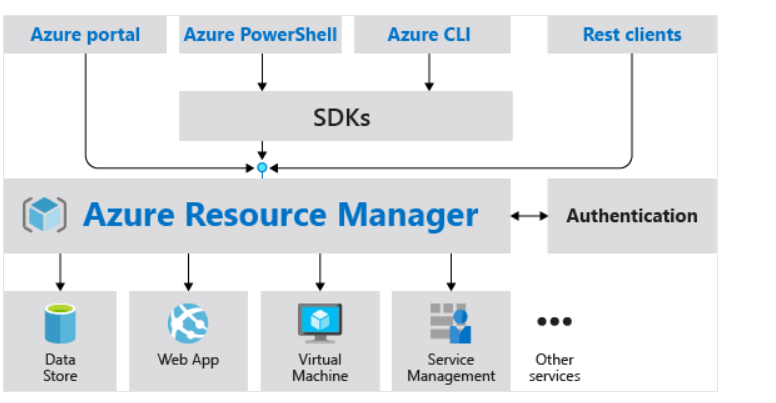
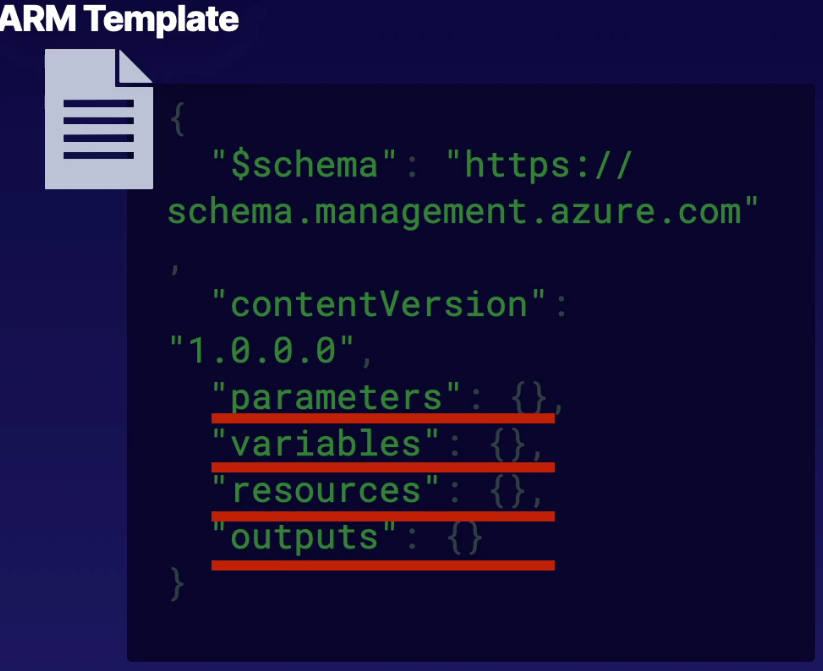

# Azure Resource Manager

**Resources**

- Clouds are made of **resources**. 
- **Resources** are an entity managed by Azure.
- Resources can be VMs, Storage, Accounts, or Virtual Networks.
- Each resources have a resource provider.

**Resource Groups**

- Are logical container for grouping resources.
- Group resources based on lifecycle and security.
- Resources can only exist in one resource group.
- Resource Groups cannot be renamed.
- Resource Groups can have resources of many different types (services).
- Resource Groups can have resources from many different regions.

**Azure Subscription**

- logical construct that groups together resource groups and associated resources
- billing unit for Azure cloud.

**Azure Resource Manager (ARM)**

- ARM is the orchestration layer for managing the Azure cloud.
- Uses REST API endpoint.
- We can use one of the following:
	- **Azure portal**
	- **Azure CLI**
	- **Azure PowerShell**

**Azure CLI VS PowerShell**

- **Azure CLI**:
	- A command-line utility for managing Azure resources.
	- Create & manage resources without logging in to Azure Portal.
	- Create script to automate tasks.
	- _example:_ `az create group`, `az version`, `az vm create`

- **Azure PowerShell**:
	- A set of cmdlets for managing Azure resources.
	- Create & manage resources without logging in to Azure Portal.
	- Create script to automate tasks.
	- _example:_ `New-Azresourcegroup`, `New-AzVM`

# Azure Resource Manager (ARM) Templates

- ARM templates are a powerful tool for deploying and managing Azure resources. 
- They allow you to define your infrastructure and configuration as code, making it easier to deploy, update, and manage your Azure environments consistently and reliably.
- Use declarative JSON to define our resource in configuration.
- Deploy environment quickly.

**Components of ARM Templates**

 - 1. **Schema:**
    - Specifies the version of the ARM template schema that defines the structure and rules for the template.

2. **Content Version:**
	- A user-defined version of the template to manage updates and changes.
        
3. **Parameters:**
    - Define values that you can pass to the template at deployment time. 
    - They allow for customization of the template's behavior without changing the template itself.
        
4. **Variables:**
    - Store values that you want to reuse within the template. 
    - Variables are not exposed to the user and can simplify complex templates by avoiding repetition.
        
5. **Resources:**
    - Define the Azure resources to deploy and their configurations. 
    - This section contains the main body of the template and is where you specify the types, properties, and dependencies of resources.
        
6. **Outputs:**
    - Return values from the template after deployment. 
    - Outputs can be used to pass information to other deployments or to display useful information to the user.

> **Hands-On** 
> 	- Create and Deploy ARM Templates from Azure portal and CLI.
> 	- Create Resource Group.
> 	- Create Azure Resource Manager locks.