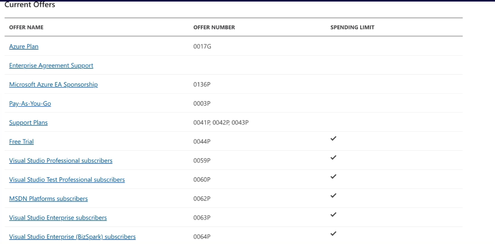

# Managing Subscriptions

- Billing unit that aggregates all costs of underlying resources.
- Contain resource groups and their associated resource.
- Scoping level for governance and security.
- A subscription is only associated with a single Azure AD tenant, but Azure AD tenant can have multiple subscription associated.

### Types of Azure Subscriptions

### Subscription Naming Convention

1. **Prod/Dev/Staging**
	- Subscriptions named based on whether or not they are production, development, or staging environment.

1. **Department/Teams**
	- Subscriptions named based on the department or team the subscription is intended for, so that billing can then be easily associated with a given business unit.

1. **Region**
	- Subscriptions named based on the region of the business that uses the subscription.

> **Hands-On:** Explorer subscription service in Azure Portal.