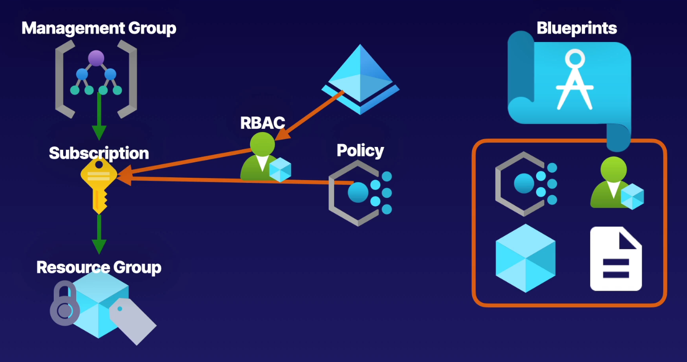

# Building a Cloud Governance Strategy

#### Governance Services

- **Management Groups and Subscriptions:** Organize subscriptions into hierarchical structures.
- **Azure RBAC:** Provide access to resources at varying scope.
- **Policies and Blueprint:** Implement policies to enforce standards and provide blue prints for cloud environment.
- **Locks and Tagging**

