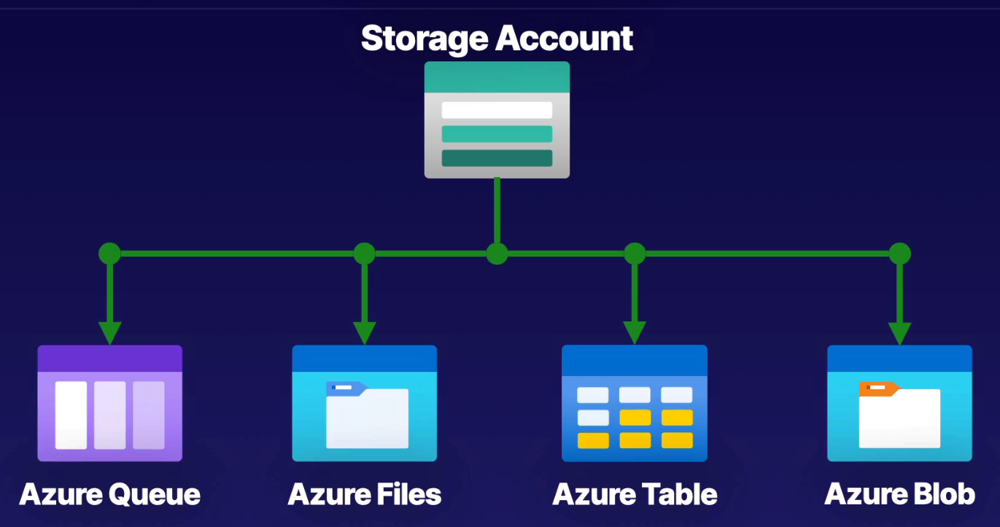

# Storage Accounts

## Components of Storage Accounts

Azure Storage Accounts provide scalable, durable, and highly available cloud storage solutions.

### Key Components:

1. **Storage Types**:
    - **Blob Storage**: For unstructured data like text or binary data. Uses containers to organize blobs.
    - **File Storage**: Provides managed file shares in the cloud using the SMB protocol.
    - **Queue Storage**: For storing and processing messages in a queue.
    - **Table Storage**: For NoSQL data storage, offering fast and cost-effective access to data.

2. **Storage Account Types**:
    - **General Purpose v2 (GPv2)**: Supports all the Azure Storage services and provides the latest features, including Azure Data Lake Storage capabilities.
    - **General Purpose v1 (GPv1)**: Older version, less feature-rich but still supports blob, file, queue, and table storage.
    - **Blob Storage**: Specifically optimized for storing large amounts of unstructured data. Features include blob tiers and access tiers.
    - **Premium Storage**: For high-performance needs with SSD-backed storage, suitable for I/O-intensive applications.

3. **Performance Tiers**:
    - **Standard**: Utilizes HDDs and is cost-effective for general-purpose applications.
    - **Premium**: Uses SSDs, providing high performance for I/O-intensive workloads.

4. **Replication Options**:
    - **Locally Redundant Storage (LRS)**: Keeps data replicated within a single region.
    - **Geo-Redundant Storage (GRS)**: Replicates data to a secondary region for disaster recovery.
    - **Read-Access Geo-Redundant Storage (RA-GRS)**: Similar to GRS but also allows read access to the secondary region.
    - **Zone-Redundant Storage (ZRS)**: Replicates data across multiple availability zones within a region, offering higher durability.

5. **Access Tiers (Blob Storage)**:
    - **Hot**: For data that is accessed frequently.
    - **Cool**: For infrequently accessed data, with lower storage costs but higher access costs.
    - **Archive**: For rarely accessed data, with the lowest storage costs but higher retrieval costs and latency.

6. **Shared Access Signatures (SAS)**:
    - Provide limited access to resources in a storage account without exposing your account key. Useful for granting permissions to clients.

7. **Azure Active Directory Integration**:
    - Allows for identity-based access control to Azure Storage resources, offering more secure and manageable access compared to traditional shared keys.

8. **Storage Account Security**:
    - **Encryption**: Data is encrypted at rest using Azure Storage Service Encryption (SSE) and in transit with HTTPS.
    - **Network Security**: Integrates with Virtual Networks and network rules to control access based on IP addresses or virtual network service endpoints.

9. **Monitoring and Management**:
    - **Azure Monitor**: For tracking and managing storage account performance and usage.
    - **Alerts**: Can be configured to notify you of certain conditions or thresholds.