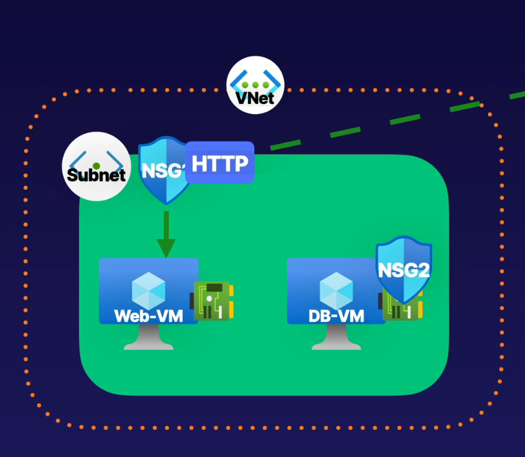

# Network Security Groups (NSGs)

- **NSGs** are crucial for controlling and filtering network traffic within Azure virtual networks. They enable you to define and enforce security policies to control inbound and outbound traffic to your resources.

#### Key Concepts

1. **Traffic Control**:
    - **NSGs** manage the flow of traffic to and from network interfaces (NICs), virtual machines (VMs), and subnets in a virtual network.

2. **Filtering Traffic**:
    - **Inbound and Outbound Rules**: NSGs allow you to specify rules for inbound and outbound traffic to enforce security policies.

3. **Rules**:
    - **Default Rules**: Automatically created and cannot be deleted. These rules provide basic security and traffic control out of the box.
    - **User-Defined Rules**: Custom rules you create to override default rules and implement specific security policies.

4. **Priority**:
    - **Rule Priority**: Each rule in an NSG has a priority number. Rules are processed in order of their priority, where a lower number indicates a higher priority.
    - **Action**: The action (Allow or Deny) taken by the first rule that matches the traffic determines the final action on that traffic.

5. **Association**:
    - **Subnet and Network Interface Association**: NSGs must be associated with either a subnet or a network interface (NIC) to be effective.
    - **Application Security Groups (ASGs)**: ASGs can be used in NSG rules to simplify rule management, but they only have an effect when associated with a subnet or NIC.

6. **Precedence**:
    - **Traffic Guidance**: Traffic is evaluated against NSG rules based on the rules' priority. Ensure that you design rules to guide traffic effectively according to your security needs.

7. **Architecture of NSGs**:
    - **Structure**: NSGs consist of a set of rules that define how traffic should be handled. The architecture includes rule sets, priority assignments, and associations to network components.
    - 
    

#### Best Practices

1. **Apply the Principle of Least Privilege**:
    - Only allow the minimum necessary traffic to ensure security and reduce exposure.

2. **Regularly Review and Update Rules**:
    - Continuously monitor and adjust NSG rules to adapt to changes in your network environment and security requirements.

3. **Utilize Logging and Monitoring**:
    - Enable NSG flow logs for detailed traffic insights and use Azure Monitor for analysis and troubleshooting.\

4. **Combine with Other Azure Security Features**:
    - Use NSGs alongside Azure Firewall, Application Security Groups (ASGs), and Azure Bastion to enhance network security and access control.